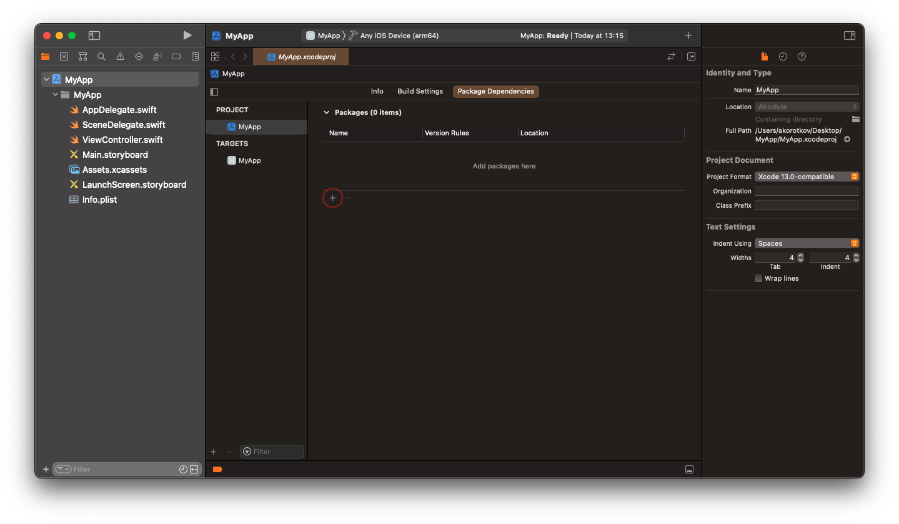
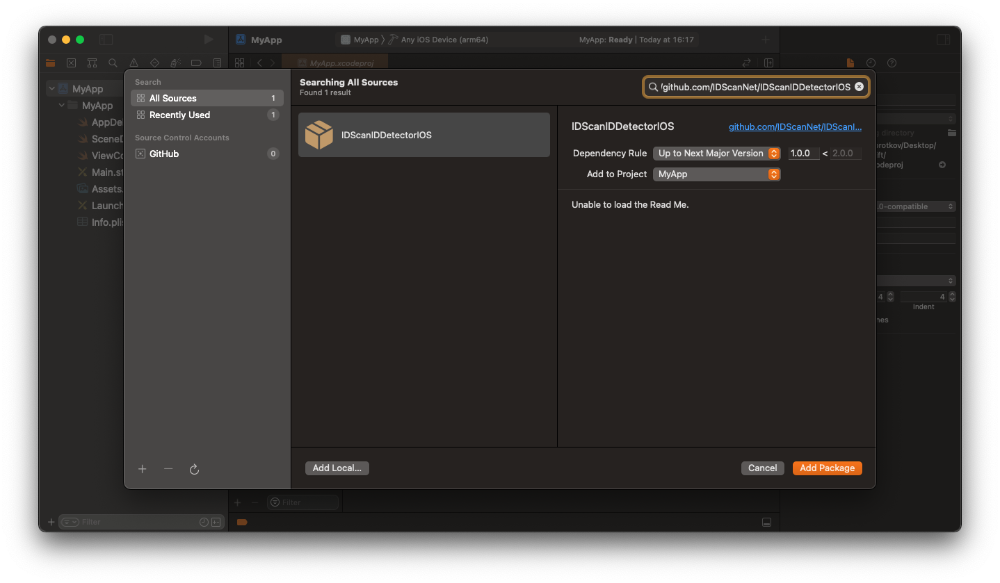
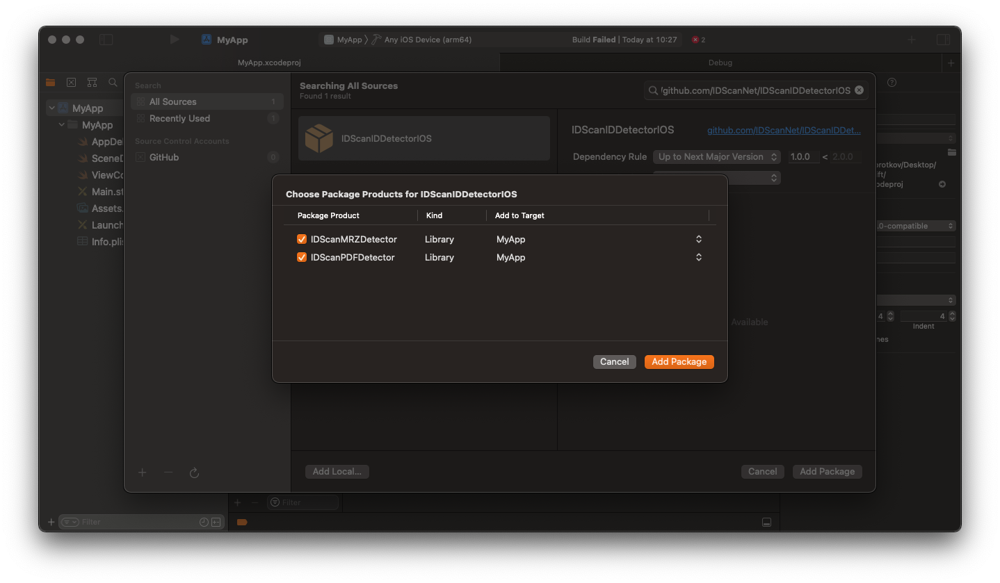

# IDScanIDDetector

---

## Installation

### Installing from Xcode (relevant for both Swift and Objective-C projects)

Add the package by selecting `Your project name` → `Package Dependencies` → `+`.



---

Search for the **IDScanIDDetector** using the repo's URL:
```console
https://github.com/IDScanNet/IDScanIDDetectorIOS
```

Next, set the `Dependency Rule` to be `Up to Next Major Version` and specify the latest version of the package as the lower bound.

Then, select `Add Package`.



---

Choose the detectors that you want to add to your project.



---

### Adding **IDScanIDDetector** to a `Package.swift`

For integration via a `Package.swift` manifest instead of Xcode, you can add **IDScanIDDetector** to the dependencies array of your package:

```swift
let package = Package(
    name: "MyPackage",
    dependencies: [
        .package(url: "https://github.com/IDScanNet/IDScanIDDetectorIOS", .upToNextMajor(from: "1.0.0"))
    ],
    // ...
)
```

Then, in any target that depends on the detectors, add it to the `dependencies` array of that target:

```swift
.target(
  name: "MyTarget",
  dependencies: [
    .product(name: "IDScanPDFDetector", package: "IDScanIDDetectorIOS"),
    .product(name: "IDScanMRZDetector", package: "IDScanIDDetectorIOS")
  ]
),
```

---

### Installing as XCFramework (relevant for both Swift and Objective-C projects)

To install **IDScanIDDetector** as `XCFramework`, please [read here](https://github.com/IDScanNet/IDScanIDDetectorIOS/tree/master/Libs#idscaniddetector)

---

## How to Activate

### Obtaining a License Key for PDF Detector or MRZ Detector

In order to receive the License Key send an email to support@idscan.net with the Bundle ID. Please be sure to provide your order number in the email once ready to upgrade from trial to production mode. A unique Serial number/Registration Key is provided for this Bundle ID.

---

## Usage

### Swift

```swift
import IDScanPDFDetector
import IDScanMRZDetector
```

```swift
let pdfDetector = IDScanPDFDetector(activationKey: "your License key") // = IDScanPDFDetector() for demo mode or you can specify activationKey later
let mrzDetector = IDScanMRZDetector(activationKey: "your License key") // = IDScanMRZDetector() for demo mode or you can specify activationKey later

func captureOutput(_ output: AVCaptureOutput, didOutput sampleBuffer: CMSampleBuffer, from connection: AVCaptureConnection) {

    //Method 1
    if let resultPDF = self.pdfDetector.detect(from: sampleBuffer), let resultString = resultPDF["string"] as? String {
        self.result(resultString, type: "pdf")
        return
    }
    
    if let resultMRZ = sel.mrzDetector.detect(from: sampleBuffer), let resultString = resultMRZ["string"] as? String {
        self.result(resultString, type: "mrz")
        return
    }
    
    //Method 2
    let imageBuffer = CMSampleBufferGetImageBuffer(sampleBuffer)
    var ciImage = CIImage(cvPixelBuffer: imageBuffer)
    //process an image in the necessary way (brightness, contrast, etc)
    
    if let resultPDF = self.pdfDetector.detect(from: ciImage), let resultString = resultPDF["string"] as? String {
        self.result(resultString, type: "pdf")
        return
    }
    
    if let resultMRZ = sel.mrzDetector.detect(from: ciImage), let resultString = resultMRZ["string"] as? String {
        self.result(resultString, type: "mrz")
        return
    }
}

func resultFromDetector(_ rawString: String, type: String) {
    //do something with the result (you can use the IDScanIDParserIOS (https://github.com/IDScanNet/IDScanIDParserIOS) to parse raw strings)
}
```

### Objective-C

```objc
@import IDScanPDFDetector;
@import IDScanMRZDetector;
```

```objc
@property (strong, nonatomic) IDScanPDFDetector *pdfDetector;
@property (strong, nonatomic) IDScanMRZDetector *mrzDetector;
```

```objc
- (void)configureDetectors {
    self.pdfDetector = [IDScanPDFDetector detectorWithActivationKey:@"your License key"]; // = [[IDScanPDFDetector alloc] init] for demo mode or you can specify activationKey later
    self.mrzDetector = [IDScanMRZDetector detectorWithActivationKey:@"your License key"]; // = [[IDScanMRZDetector alloc] init] for demo mode or you can specify activationKey later
}

- (void)captureOutput:(AVCaptureOutput *)captureOutput didOutputSampleBuffer:(CMSampleBufferRef)sampleBuffer fromConnection:(AVCaptureConnection *)connection {
    
    //Method 1
    NSString *pdfResultString = [self.pdfDetector detectFromSampleBuffer:sampleBuffer][@"string"];
    if (pdfResultString.length) {
        [self result:pdfResultString type:@"pdf"];
        return;
    }
    
    NSString *mrzResultString = [self.mrzDetector detectFromSampleBuffer:sampleBuffer][@"string"];
    if (mrzResultString.length) {
        [self result:mrzResultString type:@"mrz"];
        return;
    }
    
    //Method 2
    CVImageBufferRef imageBuffer = CMSampleBufferGetImageBuffer(sampleBuffer);
    CIImage *ciImage = [CIImage imageWithCVPixelBuffer:imageBuffer];
    //process an image in the necessary way (brightness, contrast, etc)
    
    NSString *pdfResultString = [self.pdfDetector detectFromImage:ciImage][@"string"];
    if (pdfResultString.length) {
        [self result:pdfResultString type:@"pdf"];
        return;
    }
    
    NSString *mrzResultString = [self.mrzDetector detectFromImage:ciImage][@"string"];
    if (mrzResultString.length) {
        [self result:mrzResultString type:@"mrz"];
        return;
    }
}

- (void)resultFromDetector:(NSString *)rawString type:(NSString *)type {
    //do something with the result (you can use the IDScanIDParserIOS (https://github.com/IDScanNet/IDScanIDParserIOS) to parse raw strings)
}
```
